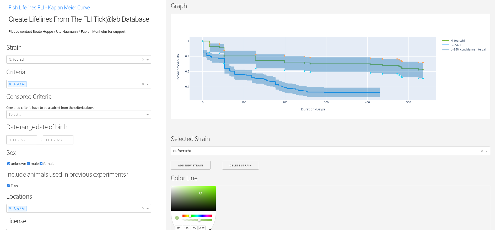

Introduction
============
**Tickatlab Survival Curves** is a webservice for research institutes to create [Kaplan-Meier survival curves](https://en.wikipedia.org/wiki/Kaplan-Meier_estimator). It has been developed at the [Leibniz institute for aging research](http://www.leibniz-fli.de) in Jena. It uses the animal database [Tick@lab](https://www.a-tune.com/products-services-software/animal-research-facility-software/) as datasource.



Contact
=======

Technical and application support: Fabian Monheim ([CF Life Science
Computing](https://www.leibniz-fli.de/research/core-facilities-services/cf-life-science-computing)), <fabian.monheim@leibniz-fli.de>, 03641-65-6872

Content support: [Animal Facility](https://www.leibniz-fli.de/research/animal-experiments/animal-facility-fish-1)

License
=======

The software was developed at the Leibniz Institute on Aging - Fritz
Lipmann Institute (FLI; <http://www.leibniz-fli.de/>) under a mixed
licensing model. Researchers at academic and non-profit organizations
can use anishare using the included license, while for-profit
organizations are required to purchase a license. By downloading the
package you agree with conditions of the FLI Software License Agreement
for Academic Non-commercial Research ([LICENSE.pdf](LICENSE.pdf)).

Installation 
============

### Requirements
Redis (Key-Value Store) --> https://redis.io/docs/latest/operate/oss_and_stack/install/install-redis/install-redis-on-linux/

### Explanation
The application was developed with [Dash Plotly](https://dash.plotly.com/), a low-code framework for rapidly building data apps in Python. It uses mainly the Python [survival analysis library lifelines](https://lifelines.readthedocs.io/en/latest/). For the Python environment we recommend a virtual environment such as pipenv or virtualenv. All required packages are listed in the file [requirements.txt](requirements.txt). To access the database a new database user should be created to access the Tick@lab database. The connection information to the database is stored in the file *local_settings.py*. You can use the file [template_local_settings.py](template_local_settings.py) and rename it.The app accesses extra database views you have to create. You find the SQL commands to create the needed views in the file [db_views_tickatlab.txt](db_views_tickatlab.txt). Furthermore it is necessary to transfer the database ids of strains and cancel and censored criteria.

### check points
- [ ] install redis https://redis.io/docs/latest/operate/oss_and_stack/install/install-redis/install-redis-on-linux/
- [ ] git clone https://gitlab.leibniz-fli.de/fmonheim/tickatlab-survival-curves.git
- [ ] create virtual environment like pipenv (```pipenv shell```)
- [ ] install packages from requirements.txt (```pip install -r requirements.txt```)
- [ ] create local_settings.py (see template_local_settings.py)
- [ ] create database views from file db_views_tickatlab.txt
- [ ] customize licenses.py, locations.py, strain_dropdown.py and app.py (Censored Criteria, Criteria)
- [ ] start with ```python app.py```


